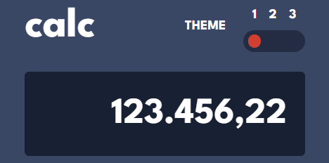
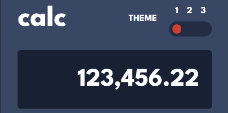
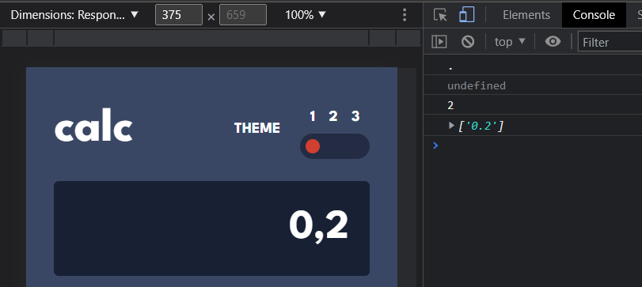
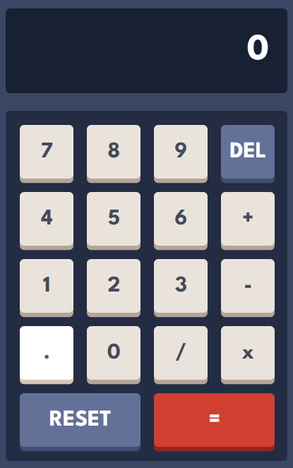
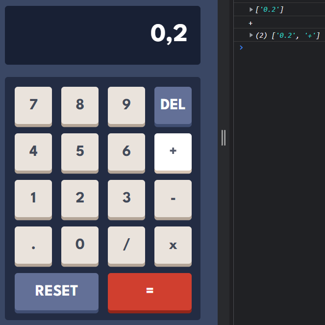

# Frontend Mentor - Calculator app solution

This is a solution to the [Calculator app challenge on Frontend Mentor](https://www.frontendmentor.io/challenges/calculator-app-9lteq5N29). Frontend Mentor challenges help you improve your coding skills by building realistic projects.

## Table of contents

- [Overview](#overview)
  - [The challenge](#the-challenge)
  - [Screenshot](#screenshot)
  - [Links](#links)
- [My process](#my-process)
  - [Built with](#built-with)
  - [What I learned](#what-i-learned)
  - [Continued development](#continued-development)
  - [Useful resources](#useful-resources)
- [Author](#author)

## Overview

### The challenge

Users should be able to:

- See the size of the elements adjust based on their device's screen size
- Perform mathmatical operations like addition, subtraction, multiplication, and division
- Adjust the color theme based on their preference
- **Bonus**: Have their initial theme preference checked using `prefers-color-scheme` and have any additional changes saved in the browser

### Screenshot
  Desktop:


  Mobile:


### Links

- Solution URL: [Frontend Mentor](https://your-solution-url.com)
- Live Site URL: [GitHub](https://your-live-site-url.com)

## My process

### Built with

- Semantic HTML5 markup
- CSS custom properties
- Flexbox
- CSS Grid
- [Sass](https://sass-lang.com/) - CSS Preprocessor
- [Prettier](https://prettier.io/) - Code Formatter


### What I learned

There was so much new things on this project I wanted to learn. Switching among more than two themes, keeping the users choice, making the calculator work... it was fun.

#### Themes

I decided to apply the themes through radio inputs on a html class, so it would affect the entire page. I worked with toggle themes before, but that logic don't apply really well when we have more than two options and the `prefers-color-scheme` was a new concept for me.

Starting with the variables:

```js
const html = document.documentElement;
const radioBtns = document.querySelectorAll('input[name=theme]');
const osDark = window.matchMedia('(prefers-color-scheme: dark)');
const osLight = window.matchMedia('(prefers-color-scheme: light)');
```

Since I already had a variable for the radio inputs, I wanted to identify the selected one instead of creating a variable for each of them, but I didn't know how to do it. I got a little enlightenment on this [article]() wrote by [Robert Dixon](https://robertd.co.uk/), but I had to separate them anyway.

```js
function setOsTheme(preference) {
	if (preference === 'dark') {
		html.classList = 'first';
		let btnFirst = document.querySelector('#first');
		btnFirst.checked = true;
	} else {
		html.classList = 'second';
		let btnSecond = document.querySelector('#second');
		btnSecond.checked = true;
	}
}
```

The OS variables were used afterwords to check the system's preference and change the theme accordingly.

```js
if (osDark.matches) {
	preference = 'dark';
}

if (osLight.matches) {
	preference = 'light';
}
```

To switch themes with the radio buttons I used a loop to check if a input was checked and to replace the html class with its information, in this case it was their ID. This was the first step I did, but it changed along the way and ended up like this.

```js
for (const radioBtn of radioBtns) {
	radioBtn.addEventListener('change', function () {
		if (this.checked) {
			html.classList = '';
			html.classList.add(this.id);
			const themeName = html.classList.value;
			localStorage.setItem('theme', themeName);
		}
	});
}
```

I used the ``const themeName`` to get the dynamic information as it changes every time a new input is selected and to store it on the browser through ``localStorage``, so it can keep the users choice.

Lastly, I needed to know if the user had chosen a theme or not. For that, I needed to get it from ``localStorage``. But, what if it's the first time the user is coming to this page? Well, in that case the page will display a theme based on their OS.

```js
window.onload = () => {
	if (typeof Storage !== 'undefined') {
		const getTheme = localStorage.getItem('theme');
		if(getTheme){
			html.classList = getTheme;
			document.getElementById(getTheme).checked = true;
		} else{
			setOsTheme(preference);
		}
	}
}
```

Now, there are two ifs here. While the first one validates if the browser supports `localStorage`, the second one is a `getTheme` validation for other browser besides Google Chrome. They were getting ``null`` as theme when the user first came up to the page, therefore the OS theme wasn't being applied. After the validation, this problem was gone.

About the lines:
```js
const getTheme = localStorage.getItem('theme');
html.classList = getTheme;
document.getElementById(getTheme).checked = true;
```

The theme was changing fine, but the inputs weren't being cheked (the colors changed but the radio buttons didn't). This problem was fixed after that. Since I was trying to keep things dynamic, I searched if we could do that to parameters of `getElementbyID` method and we can! It's just set a variable as the parameter.

#### Making it work

About making the calculator work, I went a little far from front end and dived a bit on back end. I was studying this topic and I used some of the code I already had. The first file is about the rules needed to make it work and the second one is about the other scripts.

```html
   <script src="./scripts/controller/calculatorController.js"></script>
   <script src="scripts/calculator.js"></script>
```

Aside the regular functions, I wanted to clear everything on two more situations: when the user press `DEL` twice and when they press a number after pressing ``=`` (I imagine they want to start a new calculation). So, I came up with the following code:

```js
    del() {
        if (this._countEqual > 0 || this._countClearEntry >= 2) {
            this.clearAll()
            this._countEqual = 0
            this._countClearEntry = 0
        } else {
            this.clearEntry()
        }
    }
```

It checks if ``=`` was pressed at all or if ``DEL`` was pressed twice. If so, it clears all and reset the counting, if not, it only clears the last entry. The counting is done every time the user press the respective button.

```js
case 'DEL':
    this._countClearEntry += 1
    this.del()
    break
case '=':
    this.calc()
    this._countEqual += 1
    break
```

I also thought about displaying the number separators according to the user system's locale, so I added the following code on the display:

```js
    set displayCalc(value) {
        let num = parseFloat(value)
        let numFormatted = num.toLocaleString(undefined, {
            maximumFractionDigits: 4,
        })

        if (numFormatted.length > 10) {
            this.setError()
            return false
        }
        this._displayCalcEl.innerHTML = numFormatted
    }
```

The results:

if I am in Brazil



if I am in the US




Another thing I wanted to reuse was adding the ``0 + decimal separator ('.', ',')`` after they press the `.` button when there's nothing on the display.

```js
if (this.isOperator(lastOperation) || !lastOperation) {
            this.pushOperation('0.')}
```

This code used to work before the `toLocaleString()`, but now it doesn't display a thing even though it adds the separator on the calculation.



As an alternative solution, I applied `:focus` to the button so they know it was pressed. I was planning on doing that to the operation buttons at first, because of the same thing: they didn't appear on the display.

```html
<button id="dot" class="on-focus">.</button>
<button id="division" class="on-focus">/</button>
<button id="multiplication" class="on-focus">x</button>
<button id="subtraction" class="on-focus">-</button>
<button id="addition" class="on-focus">+</button>
```


```css
.on-focus:focus {
	filter: brightness(120%);
}
```

The results:

Decimal separator:



Operators:




### Useful resources

These articles helped me understanding how to work with `prefer-color-scheme` and `localStorage`.

- [Dark Mode - The prefers-color-scheme Website Tutorial](https://www.ditdot.hr/en/dark-mode-website-tutorial) by [Ekaterina Vujasinović](https://github.com/EkaterinaVu) from [Ditdot](https://www.ditdot.hr/en). It explanins about both topics, but it was designed to only work with two themes.

- [Smart Dark Mode Toggle Based On prefers-color-scheme And localStorage](https://www.cssscript.com/dark-mode-color-scheme-localstorage/) by [Robert Dixon](https://robertd.co.uk/). It has another perspective from the first one and also only works with two themes.

- [How To Add Multiple Themes and set them to local storage](https://medium.com/the-techlife/how-to-add-multiple-themes-and-set-them-to-local-storage-d111f883b55) by [Nidhisharma](https://nidhisharma639593.medium.com/). This one was written because of this challenge, it has a whole new vision since it expands the number of themes we can use.

Regarding the dynamic ID on `getElementById`, I found what I needed on the forum below:

- [How do you get a dynamic id with getElementById in Javascript?](https://medium.com/the-techlife/how-to-add-multiple-themes-and-set-them-to-local-storage-d111f883b55)


## Author

- GitHub - [Nicholas Albuquerque](https://github.com/nicoams)
- Frontend Mentor - [@nicoams](https://www.frontendmentor.io/profile/nicoams)